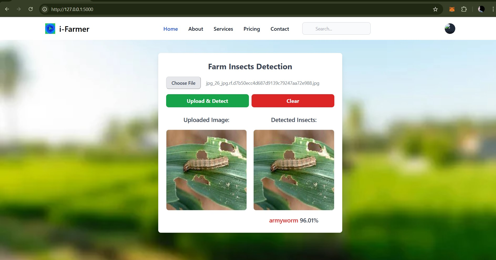

Here are the step-by-step instructions

##### 1- For Training : 
So used Google Colab(T4) to train our Insect Yolo model . Here we researched with various model but we got best result on Yolov8m (Insect-Yolo). In 200 epoch we got the best result. Here we Used 
Batch size = 16. 
Learing rate was = 1e-2
Optimizer = AdamW
Pool = Max
Momentum = 0.937

We from here we got our best.pt file as our trained file. 

##### 2 - Real-Time System :
We build a real-time system for our research to implement our best.pt (our trained model). 

##### 2.1 - Backend :
To developed backend of our real-time system we utilized Flask 3.1.0 . All about of backend is code is displayed in app.py in the folder structure. 

##### 3 - Frontend : 
To depeloped our real-time system's frontend we used html and for desining our website we used tailwind css. We used a background image here. 

##### 4 - Predicted Output Using Our Real-time System : 

#### Download yolov8m weights:
Download yolov8m weigths and place in your Flask app code directory.

####  Run the Python Script:
Once you're in the directory containing your app.py file, run the following command:
<b>python app.py </b>

Following these steps should launch your Flask web application, allowing you to access it through a web browser or any other HTTP client.

